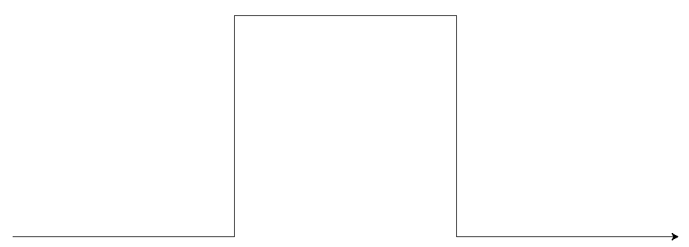
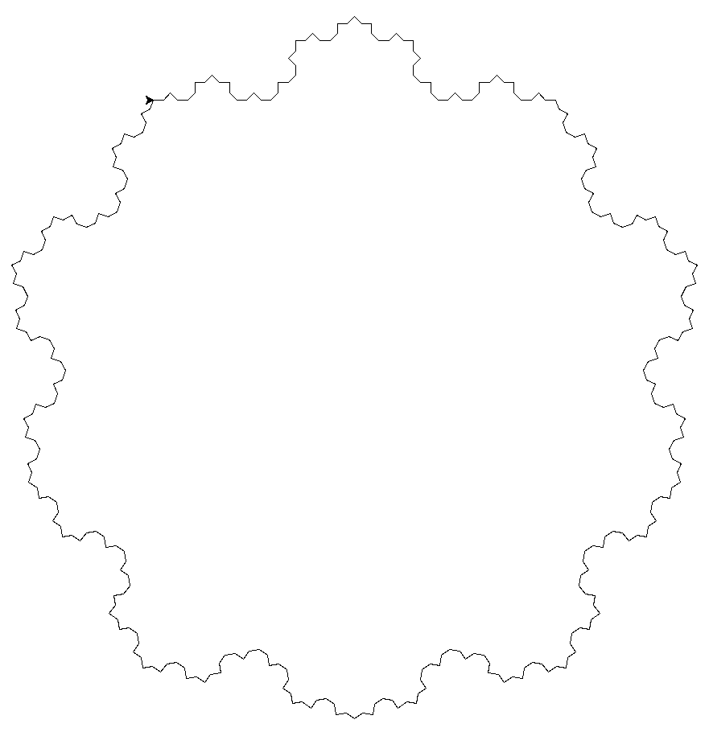

# Projet de fractales avec turtle

## Qu'es ce qu'une fractale?

Une fractale est une figure mathematique qui a la particularite d'etre
auto-similaire. L'auto-similarite est le fait qu'une partie ou sous-partie
d'une fractale ressemble a la fractale entiere. Elle peuvente etre en 1-D,
tel qu'une ligne pointillee d'une certaine facon, en 2-D, comme la plupart
des fractales, en 3-D ou meme en n-D!

Nous pouvons trouver les fractales dans les mathematiques comme dans la
nature. En voici quelques exemples de ces deux mondes, qui peuvent a
premier coup d'oeil sembler si differents.

Mais pourquoi se contenter de juste les regarder ? Nous pouvons les
construire! Il y a de nombreuses fractales qui sont assez connues, mais
n'hesitez pas a laisser votre imagination vous laisser porter. Cela peut
toujours donner des figures magnifiques et interessantes.

## Les fonctions

Pour construire une fractale, il faut faire une serie d'actions, une sorte
de procedure.  En python (le langage dans lequel nous allons dessiner nos
fractales), une procedure, ou fonction, est definit comme ceci:

```python
def ma_fonction():
    action 1
    action 2
    action 3
    ...
```

### Dessiner une ligne

Ecrivons notre premiere fonction. Nous allons just commencer par dessiner
une ligne toute simple.

```python
from turtle import *        # ligne necessaire pour pouvoir dessiner

def dessiner_une_ligne():   # definition de la fonction
    goto(-100, 0)           # aller a la position (-100, 0)
    pendown()               # commencer a dessiner
    forward(200)            # avancer de 200 unites
    penup()                 # arreter de dessiner

dessiner_une_ligne()        # appeler la fonction `dessiner_un_ligne`
```

Nous avons ici une fonction `dessiner_une_ligne` qui execute une serie
d'actions.
    - La premiere action est d'appeler la fonction `goto` qui deplace
      le curseur aux coordonnees indiques entre les parentheses, qui sont 
      (-100, 0).
    - La deuxieme action est d'appeler la fonction `pendown` qui permet de
      dessiner la ou le curseur se deplace. C'est litteralement 'mettre le
      stylo sur la page' en anglais.
    - La troisieme action est d'appeler la fonction `forward` qui avance le
      curseur de la distance donnee, qui est de 200 unites.
      Comme la fonction `pendown` a ete appelee, ceci laisse une trace sur la
      page.
    - La quatrieme et derniere action est d'appeler la fonction `penup` qui
      nous permet de lever le stylo et arrete de dessiner.  Elle est pas
      necessaire dans ce cas, mais c'est une bonne habitude a prendre de
      remetres les choses comme elles etaient au debut de la fonction.

### Dessiner des angles

Avec une simple ligne, on est encore loin d'une fractale. Rendons notre
fonction un peu plus complexe. Nous avons deja vu quelques actions, mais
une derniere peut vraiment nous permettre de faire des figures: tourner.
Pour tourner, nous appelons les fonctions `left` et `right` pour tourner
respectivement a gauche et a droite, en indiauqnt le nombre de degrees
qu'il faut tourner.

Par exemple, _avancer_ puis _tourner de 90 degrees_ puis _avancer_
donnerait le code suivant :

```python
from turtle import *

def dessiner_une_ligne_carree():
    goto(-100, 0)
    pendown()
    forward(200)            # avancer
    left(90)              # tourner de 90 degrees
    forward(200)            # avancer
    penup()

dessiner_une_ligne_carree()
```

Pour tourner dans l'autre sens, il suffit d'ecrire `rotate(-90)`

Avec notre nouvel outil, essayons de reproduire le dessin suivant:

{width=6cm height=2cm}
\ 

Il faut avancer, tourner a gauche, avancer, tourner a droite, avancer,
tourner a gauche et en fin avancer a nouveau.

Essayez de le faire par vous-meme en modifiant le code precedent avant de
regarder notre solution juste en dessous.

```python
from turtle import *

def dessiner_une_ligne_carree():
    goto(-100, 0)
    pendown()
    forward(200)            # avancer
    left(90)                # tourner a gauche
    forward(200)            # avancer
    right(90)               # tourner a droite
    forward(200)            # avancer
    right(90)               # tourner a droite
    forward(200)            # avancer
    left(90)                # tourner a gauche
    forward(200)            # avancer
    penup()

dessiner_une_ligne_carree()
```

Pour accelerer le trace des lignes, il suffit d'ajouter la ligne `speed(0)`
juste avant d'appeler la fonction `dessiner_une_ligne_carree`

Vous trouverez a la fin du sujet une liste des fonctions telles que celles
deja vues (goto, pendown, penup, forwardm etc.) avec une petite
explication de ce qu'elles font. Jettez-y un coup d'oeuil, cela peut vous
inspirer a faire des figures plus interessantes.

## La recursivite : la clef des fractales

Comme vous le savez, les fractales sont des objets qui sont en theorie
identiques lorsque nous les regardons en entier, ou si nous en regardons
seulement une petite partie. Cela veut dire que pour construire une
fractale, nous voulons executer la meme sequence d'actions pour la fractale
en entier que pour une seul de ses partie.
Par exemple, nous pouvons prendre notre ligne carree que nous avons
construit precedemment, et pour chaque ligne qui la constitue, dessiner une
ligne carre au lieu.  Nous aurions donc la fractale suivante :

{width=15cm height=2cm}
\ 

Nous pouvons penser que pour cela, il faudrait ecrire le code suivant :

```python
TODO
```

Mais si nous procedons comme ceci, pour aller a un grand nombre ditertions,
il faudra ecrire enormement de code! Mais si nout reflechissons bien, nous
venons d'ecrire une fonction pour dessiner une ligne carree. Avec quelques
petites modifications, nous pouvons l'appeler pour dessiner chaque ligne au
lieu d'appeler la fonction `forward`. Voici ce que cela peut donner, mais
il y a encore des modifications a faire!

```python
from turtle import *

def dessiner_une_ligne_carree():
    pendown()
    dessiner_une_ligne_carree()     # avancer en dessinant une ligne carree
    left(90)
    dessiner_une_ligne_carree()     # avancer en dessinant une ligne carre
    right(90)
    dessiner_une_ligne_carree()     # avancer en dessinant une ligne carre
    right(90)
    dessiner_une_ligne_carree()     # avancer en dessinant une ligne carree
    left(90)
    penup()

dessiner_une_ligne_carree()
```

Mais nous avons un gros probleme! a chaque fois que nous entrons dans la
fonction `dessiner_une_ligne_carree` nous allons rappeller la fonction sans
avoir fait quoique soit.  Nous entrons donc dans une boucle infinie.
TODO introduire la solution : les arguments `itertions` et `longueur` + stopping case

Nous avons notre premiere fratale!

### Ajouter des couleurs

TODO  A voir si on veut les introduire ici, comme cest un concept un peu
plus complique

## Le flocon de Koch

Le flocon de Koch est une fractale assez connue. Comme son nom l'implique,
l'image finale d'une construction de cette fractale ressemble a un joli
flocon de neige.

{width=6cm height=6cm}
\ 

C'est en realite une fractale qui est dessinnee 5 fois. Elle est assez
facile a faire comme nous avons fait notre fractale bassee sur les lignes
carrees. En effet, le flocon de Koch suit exactement le meme principe, mais
cette fois-ci avec un triangle au lieu d'un carre.

Remplissez donc la fonction `branche_flocon` qui fait cela:

```python
from turtle import *

def branche_flocon(longueur, iterations):
    # votre code

branche_flocon(3)
```

Une fois notre fonction ecrite, nous avons juste a la repeter 5 fois en
faisant des rotations de 72 degrees entre chaque fois pour faire tout le
tours. Nous pouvons le faire avec une boucle for:

```python
for i in range(5):
    branche_flocon(500, 3)
    right(72)
```

## Une nouvelle fonctionnalite : le fill

### Remplir une zone

TODO

### L'eponge

TODO
faire une fonction qui ecrit un carre (ca nous simplifiera la vie)
une fonction un peu plus complexe : dessiner sur le carre du milieu,
puis re-iterer sur tous carres autours.

Pour rendre le trace de l'image encore plus rapide, vous pouvez mettre la
ligne `tracer(..., 0)` a cote de la ligne `speed(0)` en remplacant les
`...` par le nombre de votre choix. Attention, le plus le nombre est eleve,
le moins l'animation sera fluide. Un bon nombre pour commencer est 50.

### Le triangle de sierpinski

TODO

## Dessiner un arbre

TODO
avancer, tourner a gauche, appeler la fonction, tourner a droite,
appeler la fonction, revenir en arriere

\newpage
## Reference turtle

TODO
